# Blockchain B2B Secure — Enterprise Transaction Security System

[](https://www.hyperledger.org/projects/fabric)
[](https://openjdk.org/)
[](https://openjdk.org/)
[](https://spring.io/projects/spring-boot)
[](https://react.dev/)
[](https://www.postgresql.org/)
[](https://www.docker.com/)
[](LICENSE)

> A permissioned blockchain system for securing B2B transactions between enterprise organizations, built on Hyperledger Fabric with ERC-20 token management, multi-organization consensus, and cryptographic transaction verification.

[Project Screenshots](#How-it-works)

---

## Project Background

This project was developed in 2025 as my [Bahelor's thesis](https://www.linkedin.com/in/filip-szemraj/details/projects/1769274898483/single-media-viewer/?profileId=ACoAAEySZEQBye78VkRnrj3tITY_u8VZbq4ulZk) and defended in February of that year.
It implements a theoretical 3-organization Hyperledger Fabric consortium with token management, cryptographic transaction verification, and a web-based frontend.

The system was completed and functional from an academic perspective, but it should be treated as a thesis-grade implementation — not a production-ready solution.

Since I started my first full-stack job right after my defense, I didn’t have much time back then. Naturally, the priority at that time was adapting to the new role and responsibilities rather than polishing project documentation.

Recently, I revisited the project and decided to properly consolidate and organize it:
 - Three previously separate repositories were merged into this monorepo
 - Additional infrastructure automation scripts and health checks were added to simplify setup
 - Additional Markdown documentation was introduced (architecture, network setup, Docker workflow)
 - The README and supporting documentation were expanded with assistance from Claude Code

[The roadmap](#Roadmap) outlines the remaining documentation work and potential technical improvements.

---

## Architecture



The system models a consortium of three organizations trading goods and settling payments via blockchain-backed tokens. The **Client API** acts as the central hub — it proxies signing requests to the **Bank API** and submits signed transactions to the **Fabric network** via gRPC. The chaincode verifies RSA signatures against a hardcoded public key bundled in the chaincode JAR; the Bank API itself never communicates with the blockchain directly.

### Transaction Verification Flow

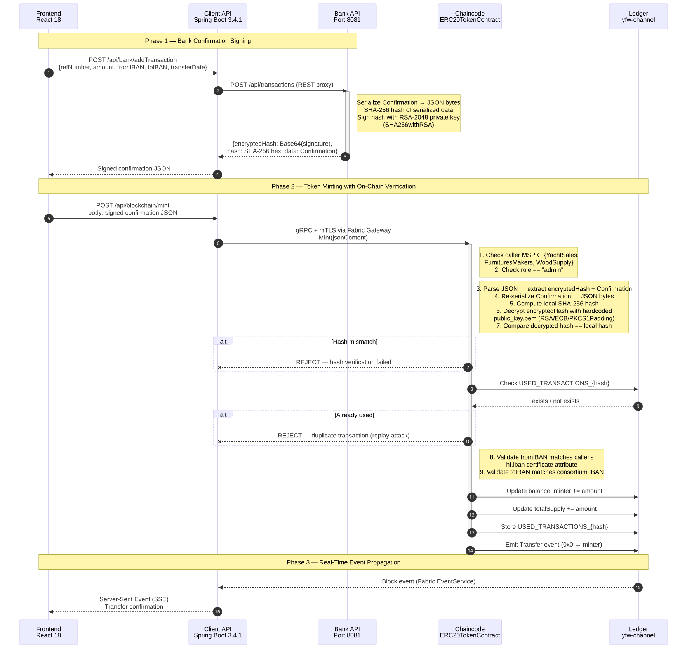

<details>
<summary>Flow summary (text)</summary>

1. Client API proxies a confirmation to Bank API (`POST /api/transactions`)
2. Bank API serializes the confirmation, computes SHA-256 hash, signs hash with RSA-2048 private key
3. Bank API returns `{encryptedHash, hash, data}` — the signed confirmation JSON
4. Client API submits signed JSON to chaincode `Mint()` via Fabric Gateway (gRPC + mTLS)
5. Chaincode re-serializes confirmation, computes local SHA-256, decrypts signature with hardcoded `public_key.pem`
6. Chaincode compares hashes, checks replay prevention (`USED_TRANSACTIONS_{hash}`), validates IBANs
7. Tokens minted, `Transfer` event emitted → SSE → Frontend updates in real time
</details>

---

## Key Features

- **ERC-20 Token Standard on Hyperledger Fabric** — Mint, burn, transfer, and approve tokens with full allowance mechanism, adapted from Ethereum's ERC-20 to a permissioned network
- **Multi-Organization Consensus** — 3-org consortium (Yacht Sales, Furnitures Makers, Wood Supply) with independent CAs, peers, and orderers
- **Cryptographic Transaction Verification** — RSA-2048 signed bank confirmations verified in chaincode before token minting
- **IBAN Governance via Voting** — Propose and vote on IBAN changes with 3-of-3 organizational consensus required
- **Replay Attack Prevention** — Transaction ID deduplication on the ledger prevents double-spending
- **Real-Time Event Streaming** — Server-Sent Events (SSE) propagate blockchain events to the frontend instantly
- **Supply Chain Delivery Tracking** — Create, start, confirm, and dispute deliveries with partial delivery support
- **Role-Based Access Control** — Admin-only minting, per-organization identity management via Fabric MSP

---

## Tech Stack

| Layer | Technology                                              | Version |
|-------|---------------------------------------------------------|---------|
| **Smart Contracts** | Java · Hyperledger Fabric Chaincode Shim                | 11 · 2.5 |
| **Backend** | Spring Boot · Spring Security · Fabric Gateway SDK      | 3.4.1 · 1.7.0 |
| **Frontend** | React · TypeScript · Vite · Redux Toolkit               | 18.3 · 5.6 · 6.0 |
| **Database** | PostgreSQL                                              | 15 |
| **Auth** | JWT (access + refresh tokens)                           | — |
| **Crypto** | RSA-2048 (bank confirmations) · X.509 (Fabric identity) | — |
| **Infrastructure** | Docker · Docker Compose · Fabric CA                     | — |
| **Consensus** | Raft (ordering service)                                 | — |
| **Build** | Gradle (Shadow JAR for chaincode, Spring Boot for APIs) | — |
| **Testing** | JUnit 5 · Mockito · JaCoCo (60 tests)                   | — |

---

## Project Structure

```
├── chaincode/                    # Hyperledger Fabric smart contracts (Java 11)
│   ├── src/main/java/            #   ERC20TokenContract, IBANVoteContract, models
│   ├── src/test/java/            #   Unit tests (JUnit 5, Mockito)
│   ├── build.gradle              #   Shadow JAR → chaincode.jar
│   └── config/checkstyle/        #   Code quality rules
│
├── backend/
│   ├── client-api/               # Main REST API (Spring Boot, Java 21)
│   │   ├── src/                  #   Auth, blockchain integration, event streaming
│   │   ├── compose.yaml          #   PostgreSQL + API containers
│   │   └── Dockerfile            #   Production container image
│   └── bank-api/                 # RSA-2048 signing oracle (Spring Boot, Java 21)
│       ├── src/                  #   RSA signing, transaction serialization
│       ├── keys/                 #   RSA key pair (public_key.pem, private_key.pem)
│       └── Dockerfile            #   Bank service container (port 8081)
│
├── frontend/                     # Web application (React + TypeScript + Vite)
│   ├── src/components/           #   Dashboard, token ops, delivery forms
│   ├── src/redux/                #   State management (Redux Toolkit)
│   └── src/config/               #   API client configuration (axios)
│
├── infrastructure/
│   └── ca/                       # Hyperledger Fabric network infrastructure
│       ├── docker-compose*.yaml  #   11 compose files (CAs, peers, orderers)
│       ├── _scripts/             #   Enrollment, channel creation, cert distribution
│       ├── _config_files/        #   configtx.yaml, orderer.yaml, core.yaml
│
├── external-bank/                # Bank simulation utilities (Python)
│   ├── generating_key_pair.py    #   RSA key generation
│   └── encryption_decryption.py  #   Signing and verification
│
├── diagrams/                     # Mermaid diagram sources + generated SVGs
│   ├── architecture.mermaid      #   System architecture diagram
│   └── mint-verification-flow.mermaid  # RSA signing/verification sequence
│
├── docs/                         # Documentation
│   ├── architecture.md           #   Detailed system architecture
│   ├── INFRASTRUCTURE_STEPS.md   #   Comprehensive network deployment guide
│   └── thesis-topic.md           #   Academic context
│
└── .env.example                  # Environment variable template
```

---

## Getting Started

### Prerequisites

| Tool | Version | Purpose |
|------|---------|---------|
| Docker & Docker Compose | 20.10+ | Container orchestration for all services |
| Java JDK | 21 | Backend APIs build and runtime |
| Node.js & npm | 18+ | Frontend build |
| Python 3 | 3.8+ | Bank RSA key generation utilities |

> **Note:** Java 11 and Gradle are only needed for [running chaincode tests locally](#testing). The chaincode itself is compiled inside Docker by Fabric's `fabric-javaenv` image during `peer lifecycle chaincode install`.

### Startup Order

The system has a strict startup dependency chain. Each layer requires the previous one to be fully operational:

```
1. Fabric Network        (CAs → orderers → channel → peers + chaincode)
2. Bank API              (independent — needs only Docker network)
3. Client API            (needs: Fabric peers + PostgreSQL + Bank API)
4. Frontend              (needs: Client API on :8080 + Bank API on :8081)
```

### Step 1: Clone and Configure

```bash
git clone <repository-url>
cd blockchain-biz-secure-chaincode-erc20-based

cp .env.example .env
# Edit .env with your settings (JWT secret, database credentials, etc.)
```

### Step 2: Start the Fabric Network

The blockchain infrastructure is the most complex component (~18-24 Docker containers depending on configuration). A comprehensive step-by-step guide with verification commands, troubleshooting, and architecture explanations is available in the dedicated infrastructure guide.

**[`infrastructure/ca/INFRASTRUCTURE_STEPS.md`](docs/INFRASTRUCTURE_STEPS.md)** — Full network deployment guide

Quick summary:

```bash
cd infrastructure/ca

# 1. Start Certificate Authorities (TLS bootstrap + org CAs)
docker compose up --build -d

# 2. Create genesis block and channel configuration
bash _scripts/run-configtx-all.sh

# 3. Start orderers (Raft consensus)
bash _scripts/run-orderer.sh

# 4. Start anchor peers (auto-installs + commits chaincode)
docker compose -f docker-compose.peer.all.yaml up --build -d

# 5. (Optional) Start inner peers
bash _scripts/run-all-inner-peers.sh
```

Verify the network is healthy:
```bash
bash check-network-health.sh
```

### Step 3: Start Bank API

Detailed setup documentation is not yet available.
<!-- TODO: detailed guide in docs/bank-api-setup.md -->

```bash
cd backend/bank-api
docker compose up -d    # Starts on port 8081
```

The Bank API auto-generates an RSA-2048 key pair on first start if `keys/` directory is empty. The matching `public_key.pem` must be bundled in `chaincode/src/main/resources/public_key.pem` before chaincode installation (already included in the repository).

### Step 4: Start Client API

Detailed setup documentation is not yet available.
<!-- TODO: detailed guide in docs/client-api-setup.md — per-org instances, crypto mounting, Fabric identity -->

```bash
cd backend/client-api
docker compose up -d    # Starts PostgreSQL + API on port 8080
```

The Client API connects to Fabric peers via gRPC+mTLS using crypto material mounted from the infrastructure layer. Each organization runs its own API instance with a distinct Fabric identity (MSP ID, certificates).

### Step 5: Start Frontend

Detailed setup documentation is not yet available.
<!-- TODO: detailed guide in docs/frontend-setup.md -->

```bash
cd frontend
npm install
npm run dev             # Development server at http://localhost:5173
```

The frontend connects to Client API (`localhost:8080`) and Bank API (`localhost:8081`) — both URLs are currently hardcoded in `src/config/`.

### Step 6: Verify End-to-End

```bash
# Query token name from chaincode (via peer container)
docker exec peer0.furnituresmakers.com peer chaincode query \
  -C yfw-channel -n basic -c '{"function":"TokenName","Args":[]}'
# Expected: IntrinsicCoin
```

---

## Smart Contract API Reference

### ERC20TokenContract

| Function | Parameters | Access | Description |
|----------|-----------|--------|-------------|
| `Initialize` | `name`, `symbol`, `decimals` | Admin | Initialize token contract metadata |
| `Mint` | `jsonContent` (signed confirmation JSON) | Admin | Create new tokens after RSA signature verification |
| `Burn` | `amount` | Owner | Request token burn (two-phase: request → finalize) |
| `FinalizeBurn` | `jsonContent` (signed confirmation JSON) | Admin | Finalize burn after RSA signature verification |
| `Transfer` | `to`, `value` | Owner | Transfer tokens between accounts |
| `Approve` | `spender`, `value` | Owner | Authorize third-party spending |
| `TransferFrom` | `from`, `to`, `value` | Approved | Execute approved transfer |
| `Allowance` | `owner`, `spender` | Any | Query approved spending amount |
| `BalanceOf` | `owner` | Any | Query token balance |
| `ClientAccountBalance` | — | Caller | Query caller's own balance |
| `ClientAccountID` | — | Caller | Query caller's account ID |
| `TotalSupply` | — | Any | Query total token supply |
| `TokenName` / `TokenSymbol` | — | Any | Returns `IntrinsicCoin` / `IC` |
| `Decimals` | — | Any | Query token decimal places |

### IBANVoteContract

| Function | Parameters | Access | Description |
|----------|-----------|--------|-------------|
| `Init` | `initialIBAN` | Admin | Initialize the contract with a starting IBAN |
| `proposeIBAN` | `proposedIBAN` | Any org member | Propose a new IBAN and cast vote (3-of-3 consensus required to activate) |
| `getCurrentIBAN` | — | Any | Query the current active IBAN |

---

## Network Topology

The system deploys **~18-24 Docker containers** (depending on configuration) across three organizations:

| Organization | Peer | Orderer | CA (Identity) | CA (TLS) |
|-------------|------|---------|---------------|----------|
| **Yacht Sales** | peer0:9051 | orderer0:9050 | ca-yachtsales:9054 | tls-ca-yachtsales |
| **Furnitures Makers** | peer0:7051 | orderer0:7050 | ca-furnituresmakers:7054 | tls-ca-furnituresmakers |
| **Wood Supply** | peer0:8051 | orderer0:8050 | ca-woodsupply:8054 | tls-ca-woodsupply |

**Channel:** `yfw-channel` (Yacht-Furnitures-Wood)
**Consensus:** Raft ordering service
**Security:** Mutual TLS between all nodes, X.509 certificate-based identity
**Docker network:** `fabric-network` (shared by all components)

---

## Testing

### Chaincode Tests

60 unit tests enforced by JaCoCo. Requires JDK 11:

```bash
# Option A: Use Docker tools image (no local JDK needed)
cd chaincode
docker compose -f docker-compose.tools.yaml run --rm chaincode-tools test

# Option B: Local JDK 11 + Gradle
export JAVA_HOME=/path/to/jdk-11
cd chaincode
gradle test                    # Run unit tests
gradle jacocoTestReport        # Coverage report → build/reports/jacoco/
```

### Backend API Tests

```bash
cd backend/client-api
./gradlew test
```

---

## Design Decisions

| Decision | Choice | Rationale |
|----------|--------|-----------|
| **Hyperledger Fabric over Ethereum** | Permissioned network | B2B transactions require identity verification and data privacy — public blockchains expose transaction data |
| **ERC-20 on Fabric** | Custom implementation | Fabric has no native token standard; implementing ERC-20 provides familiar semantics while leveraging Fabric's privacy features |
| **Java for chaincode** | Java 11 | Strong typing, enterprise ecosystem familiarity, official Fabric SDK support |
| **RSA-2048 bank verification** | External signing oracle | Separates financial verification from blockchain logic — the bank remains an independent trust anchor |
| **Hardcoded bank public key** | Bundled in chaincode JAR | Simpler deployment; key rotation requires chaincode upgrade (package → install → approve → commit across all orgs) |
| **3-of-3 IBAN voting** | Full consensus | All organizations must agree on payment routing changes — prevents unilateral financial decisions |
| **SSE over WebSockets** | Server-Sent Events | Simpler for unidirectional event push from blockchain; no bidirectional channel needed |

---

## Roadmap

- [x] ERC-20 token implementation (mint, burn, transfer, approve)
- [x] Multi-organization Fabric network with Raft consensus
- [x] RSA-signed bank confirmation verification
- [x] IBAN voting governance mechanism
- [x] Spring Boot REST API with JWT auth
- [x] React frontend with Redux state management
- [x] Supply chain delivery tracking
- [x] Real-time SSE event streaming
- [ ] Swagger/OpenAPI documentation for REST endpoints
- [ ] CI/CD pipeline (GitHub Actions)
- [ ] Environment variable externalization (remove hardcoded secrets)
- [ ] Database migrations (replace Hibernate auto-DDL)
- [ ] Integration test suite
- [ ] Bank public key rotation via ledger governance (eliminate chaincode redeployment)

---

## Academic Context

This system was developed as a bachelor's thesis project:

**Title:** *Design and Implementation of an Information System Increasing the Security of Business Transactions Through the Use of Blockchain Smart Contracts*

The thesis explores how permissioned blockchain networks can provide transaction integrity, non-repudiation, and automated dispute resolution for B2B commerce, with a practical implementation demonstrating these concepts in a multi-organization supply chain scenario.


- [Bahelor Thesis](https://www.linkedin.com/in/filip-szemraj/details/projects/1769274898483/single-media-viewer/?profileId=ACoAAEySZEQBye78VkRnrj3tITY_u8VZbq4ulZk) hosted on LinkedIn

---

## License

Distributed under the Apache License 2.0. See [`LICENSE`](LICENSE) for more information.

---

## Author

**Filip Szemraj**
- GitHub: [@FilipSzemraj](https://github.com/FilipSzemraj)

---

## Acknowledgments

- [Hyperledger Fabric Documentation](https://hyperledger-fabric.readthedocs.io/)
- [Hyperledger Fabric Samples](https://github.com/hyperledger/fabric-samples)
- [OpenZeppelin ERC-20 Standard](https://docs.openzeppelin.com/contracts/erc20)


## How it works

These screens are described in detail in the thesis. The theoretical part of the project is available on my LinkedIn profile in the Resources section of the relevant project.


### Infrastructure run in tmux - followed INFRASTRUCTURE_STEPS
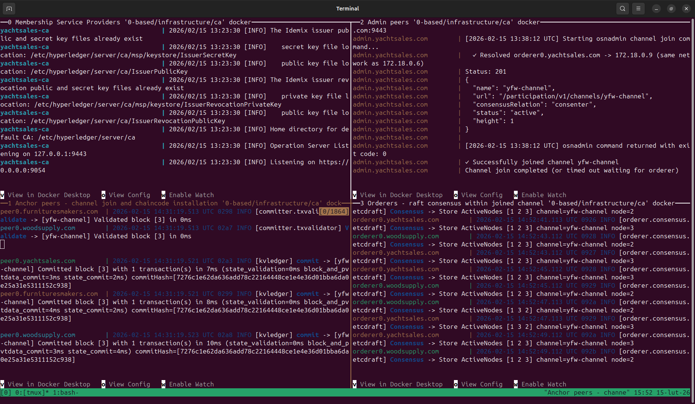

### Burn Transaction
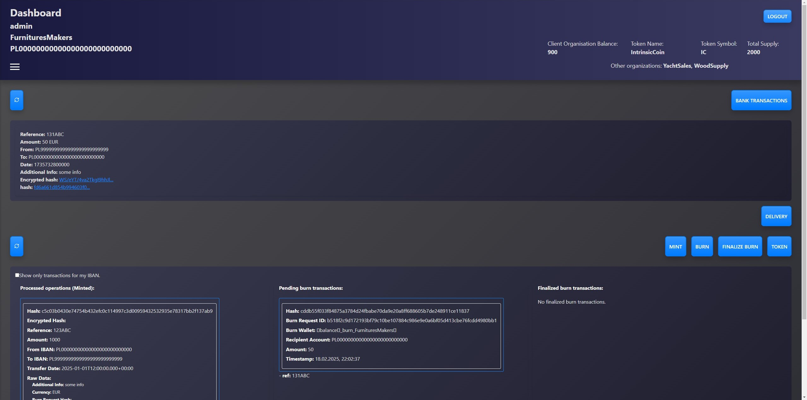

### Delivery Creating 1
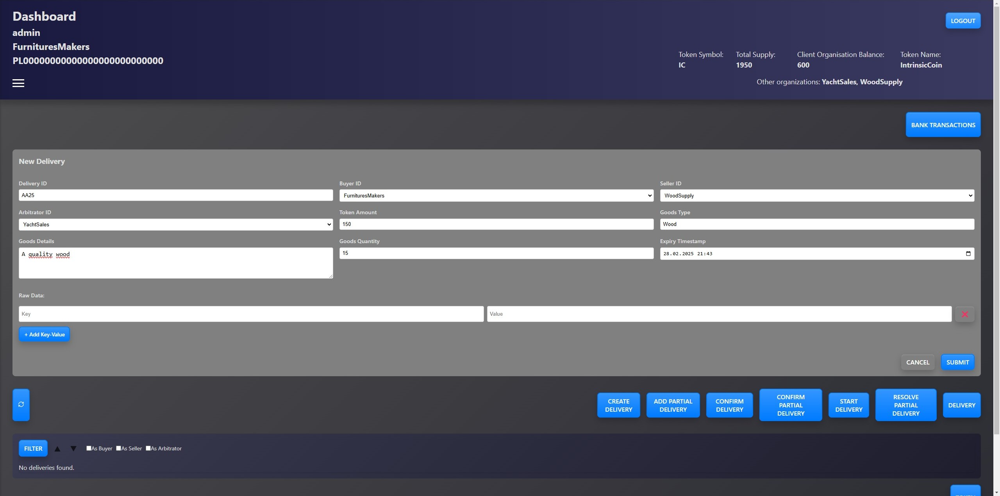

### Delivery Delivered With Partial Deliveries As Seller
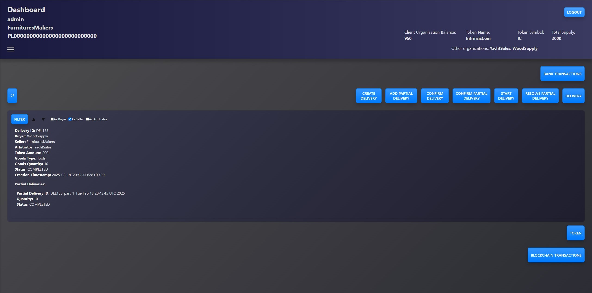

### Delivery Delivered With Partial Deliveries
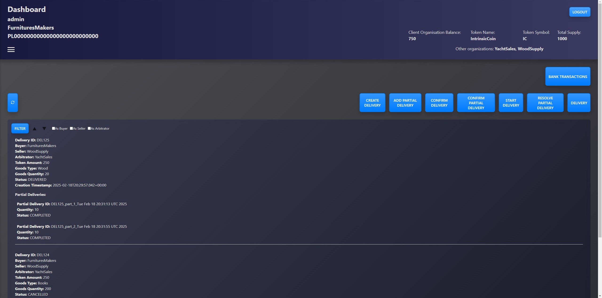

### Delivery Filter As Seller
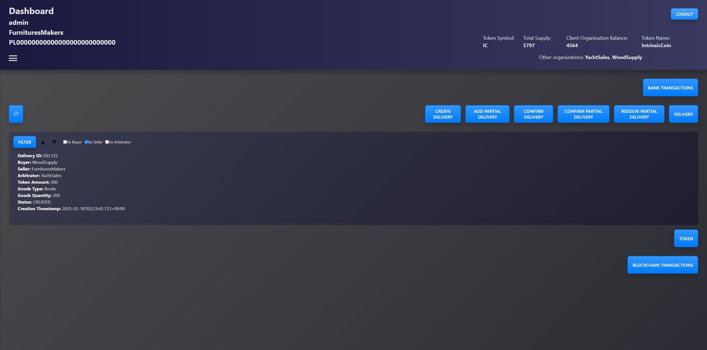

### Finalize Burn 1
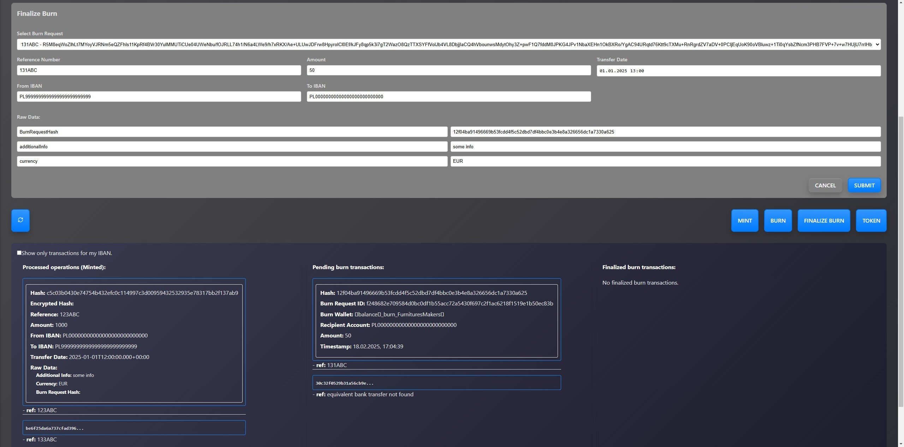

### Finalize Burn 2
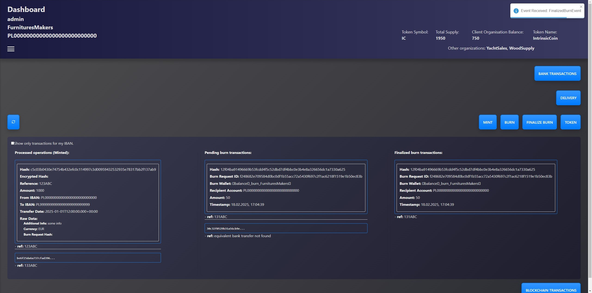

### Login


### Minting Tokens 1
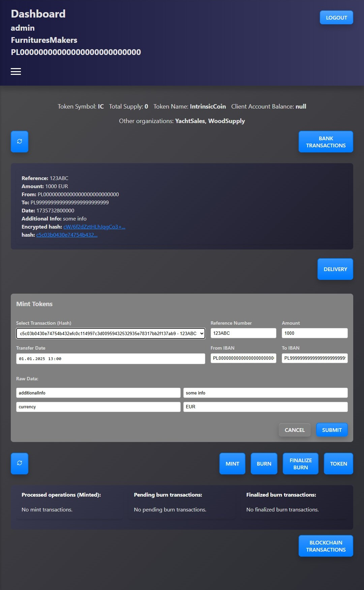

### Minting Tokens 2
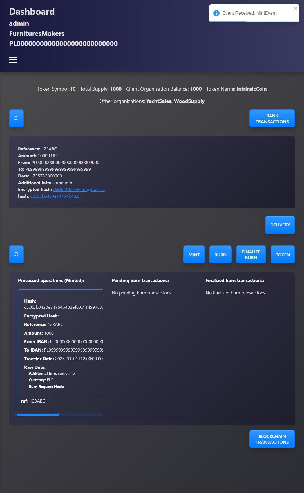

### Send Tokens 1
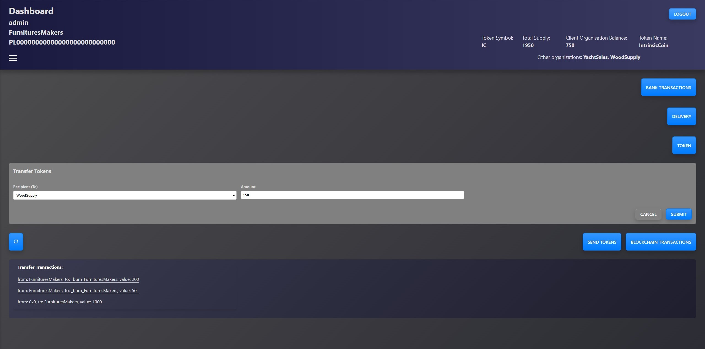

### Send Tokens 2
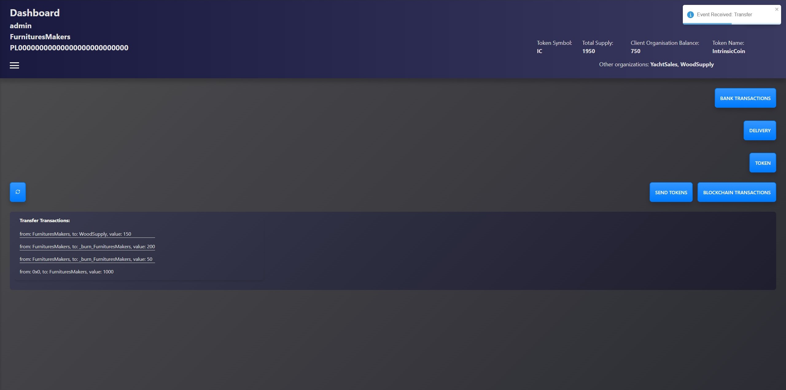

### Sidebar Collapsed
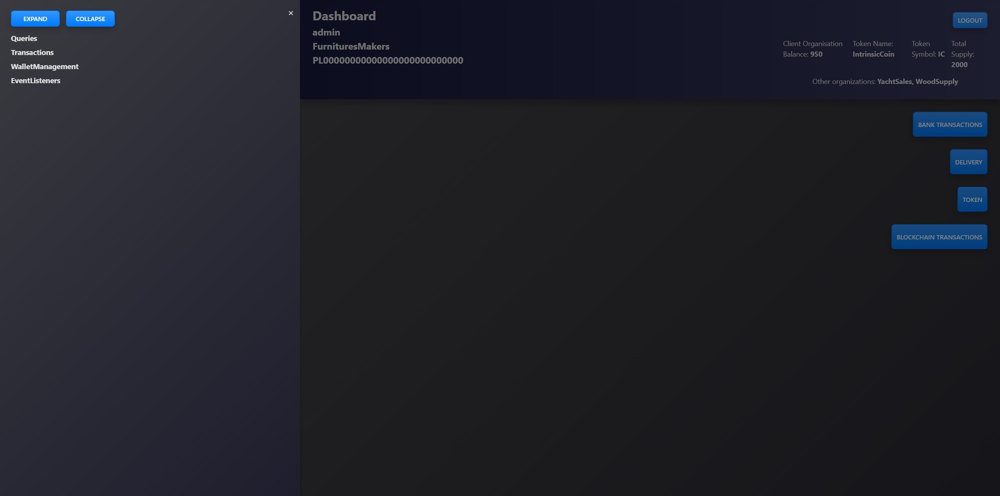

### Sidebar
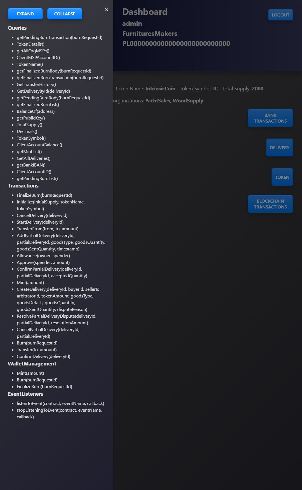

### Sidebar Narrow
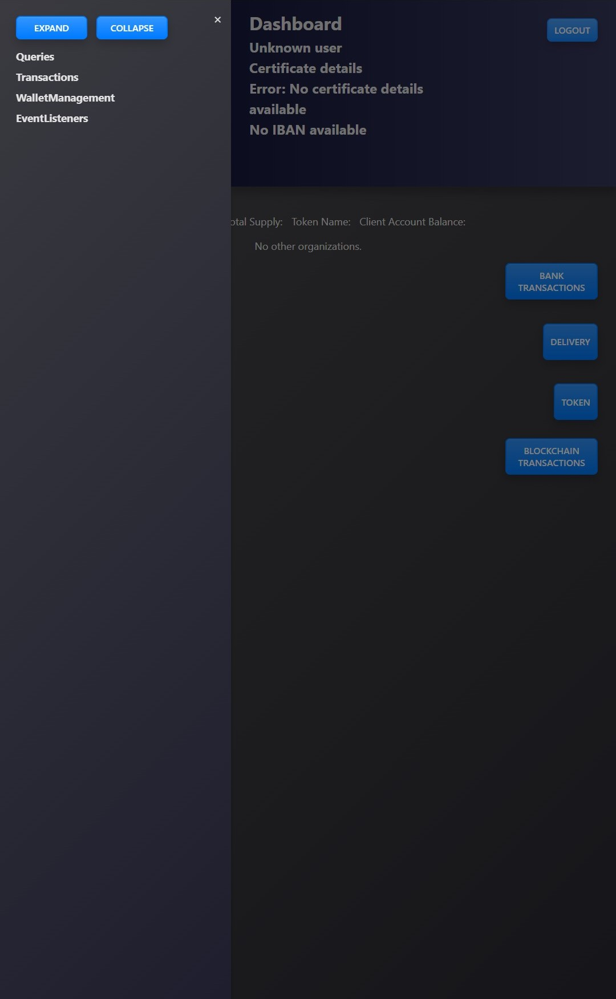

### UI
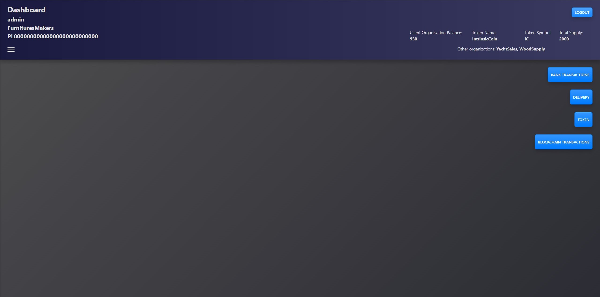

### UI Narrow
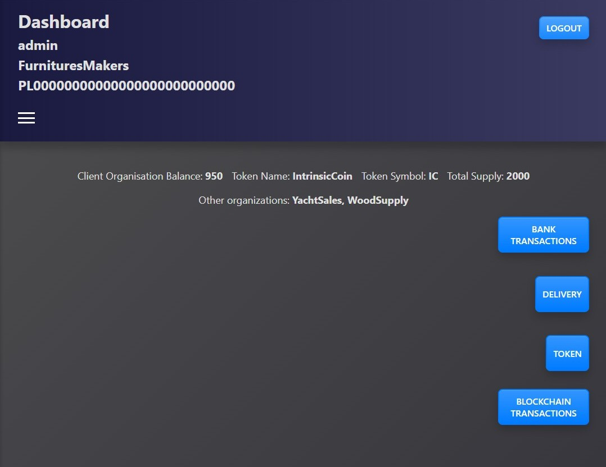


